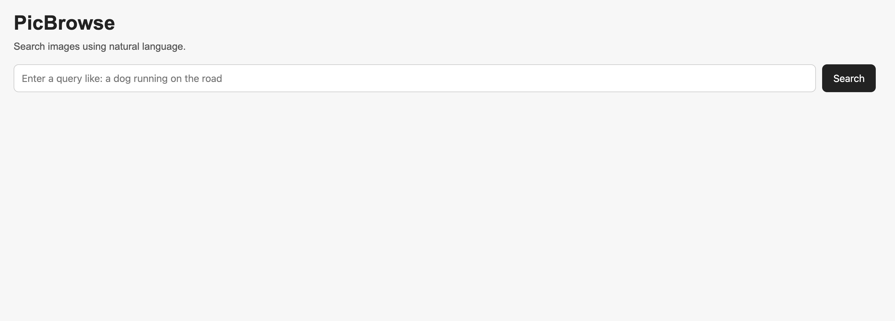
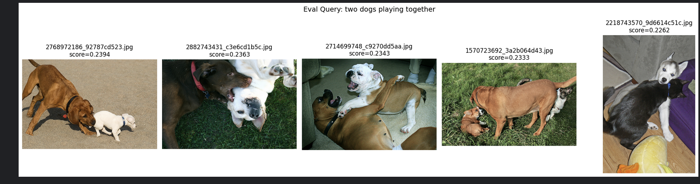
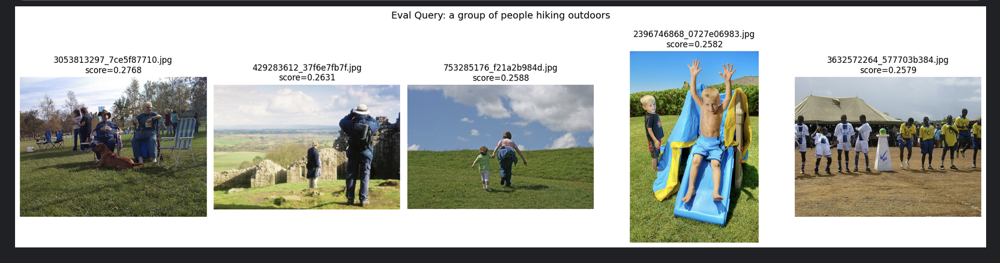
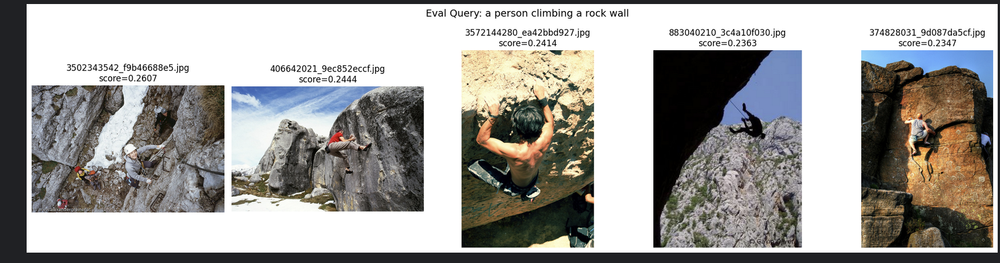
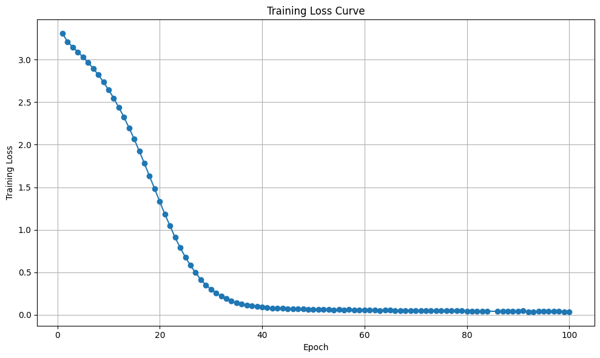

# PicBrowse

PicBrowse is a CLIP-style text-to-image retrieval system built from scratch with PyTorch.

It lets a user enter a natural-language query such as **"a dog running on the grass"** and retrieves the most relevant images from a gallery.

The project includes:
- a frozen CNN-based image encoder
- a custom Transformer-based text encoder
- contrastive training
- cached image embedding acceleration
- an image-level train/evaluation split
- a Flask web app for interactive search

---

## Demo

### Web App


### Evaluation Retrieval Examples




### Training Curve


---

## Features

- Text-to-image retrieval with natural-language queries
- Custom PyTorch training pipeline
- Frozen pretrained ResNet image encoder
- Custom tokenization pipeline
- Transformer-based text encoder
- Symmetric contrastive loss
- Cached image embeddings for faster training
- Image-level train/evaluation split to reduce leakage
- Flask-based web application for interactive search

---

## How It Works

PicBrowse learns a shared embedding space between images and captions.

### Image Side
- A pretrained ResNet encoder extracts visual features
- The image encoder is frozen during training

### Text Side
- Captions are tokenized using a custom tokenizer
- Tokens are embedded and combined with positional embeddings
- A Transformer encoder produces contextual text features
- Masked mean pooling compresses the sequence into a single vector

### Training Objective
- Image and text embeddings are normalized
- A similarity matrix is computed for each batch
- A symmetric contrastive loss is applied in two directions:
  - image-to-text
  - text-to-image

---

## Project Structure

```text
PicBrowse/
├── configs/
├── snapshots/
├── src/
│   ├── app/
│   ├── data/
│   ├── models/
│   ├── retrieval/
│   └── training/
├── requirements.txt
└── README.md
```

---

## Training Pipeline

### Dataset
The project uses the Flickr8k caption dataset.

### Data Split
To avoid leakage, the dataset is split at the **image level**, not at the caption-row level. This ensures that captions of the same image do not appear in both train and evaluation sets.

### Optimization
- Optimizer: AdamW
- Objective: symmetric contrastive loss
- Cached image embeddings were used to accelerate training

### Cached Training
Because the image encoder is frozen, image embeddings can be precomputed once and reused during training. This significantly reduces repeated image loading and CNN forward-pass cost.

---

## Evaluation

The model was evaluated on a held-out evaluation split and also inspected qualitatively using fixed retrieval queries.

Example query categories included:
- animals
- sports
- children playing
- outdoor scenes
- people and actions

The model retrieves semantically related images in many cases, although some results are still imperfect. This project is intended as a strong baseline system and a full end-to-end prototype rather than a final production-grade retrieval model.

---

## Running the App

### 1. Install dependencies

```bash
pip install -r requirements.txt
```

### 2. Prepare Artifacts

You need:
- trained checkpoint
- saved vocabulary
- cached image embeddings
- image folder

### 3. Run the Flask App

```bash
flask --app src.app.app run --host=0.0.0.0 --port=5001
```

### 4. Open in Browser

```text
http://127.0.0.1:5001
```

---

## Example Queries

Example user queries:
- `a dog running on the grass`
- `children playing outside`
- `a man riding a bicycle`
- `people playing football`

The app returns the top retrieved images along with similarity scores.

---

## Current Limitations

- Retrieval quality is promising but not perfect
- The current model uses a relatively lightweight architecture
- Evaluation is mostly qualitative at this stage
- The system can still be improved with stronger encoders and more careful tuning

---

## Why I Built This

I built PicBrowse as a hands-on project to better understand:
- cross-modal representation learning
- contrastive training
- image-text retrieval systems
- model-to-web-app integration

The project was intentionally implemented from scratch in a modular way so that both the ML pipeline and the deployment pipeline remain understandable.